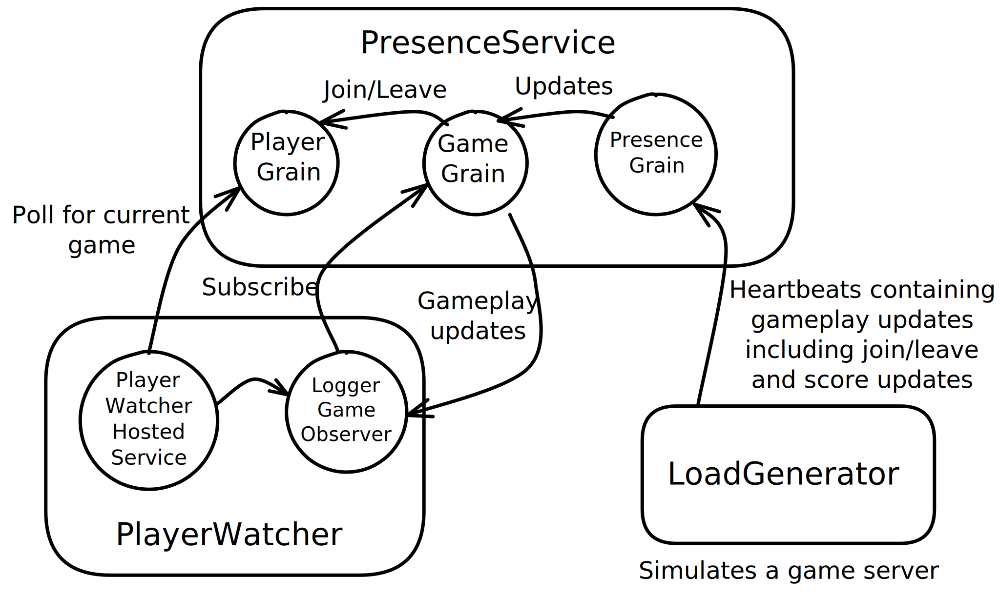

---
languages:
- csharp
products:
- dotnet
- dotnet-orleans
page_type: sample
name: "Orleans Gaming Presence service sample"
urlFragment: "orleans-gaming-presence-service-sample"
description: "An Orleans sample service demonstrating the use of the Gaming Presence service."
---

# Orleans Gaming Presence service sample

This sample demonstrates a gaming presence service in which a game server (represented by the *LoadGenerator* application) sends periodic heartbeats to a cloud service (represented by the *PresenceService* application) containing the status of a game which it is hosting. Inside the service, a corresponding `PresenceGrain` is responsible for unpacking the heartbeat message and reflecting the state of the game in the `PlayerGrain` and `GameGrain` grains. The effects of this can be seen on a client application (*PlayerWatcher*), which polls the player for the current game session. Each time a new game session is returned, the client creates a new `LoggerGameObserver` which subscribes to the game grain so that status updates are pushed to it using the `IGameObserver` interface.



## Sample prerequisites

This sample is written in C# and targets .NET 6.0. It requires the [.NET 6.0 SDK](https://dotnet.microsoft.com/download/dotnet/6.0).

## Building the sample

To download and run the sample, follow these steps:

1. Download and unzip the sample.
2. In Visual Studio (2022 or later):
    1. On the menu bar, choose **File** > **Open** > **Project/Solution**.
    2. Navigate to the folder that holds the unzipped sample code, and open the C# project (.csproj) file.
    3. Choose the <kbd>F5</kbd> key to run with debugging, or <kbd>Ctrl</kbd>+<kbd>F5</kbd> keys to run the project without debugging.
3. From the command line:
    1. Navigate to the folder that holds the unzipped sample code.
    2. At the command line, type [`dotnet run`](https://docs.microsoft.com/dotnet/core/tools/dotnet-run).

To build and run the sample step-by-step on the command line, use the following commands:

Build the solution using the .NET CLI:

```dotnetcli
dotnet build
```

Launch the server process:

```dotnetcli
dotnet run --project ./src/PresenceService
```

In a separate terminal window, launch the player watcher:

```dotnetcli
dotnet run --project ./src/PlayerWatcher
```

In a separate terminal window, launch the load generator:

```dotnetcli
dotnet run --project ./src/LoadGenerator
```
